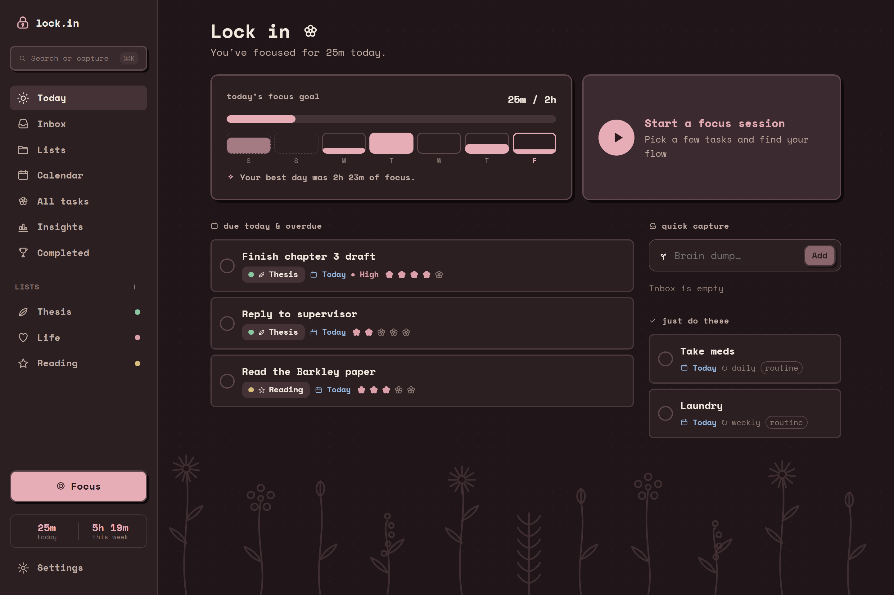
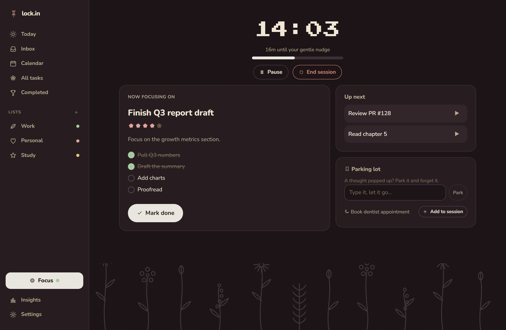
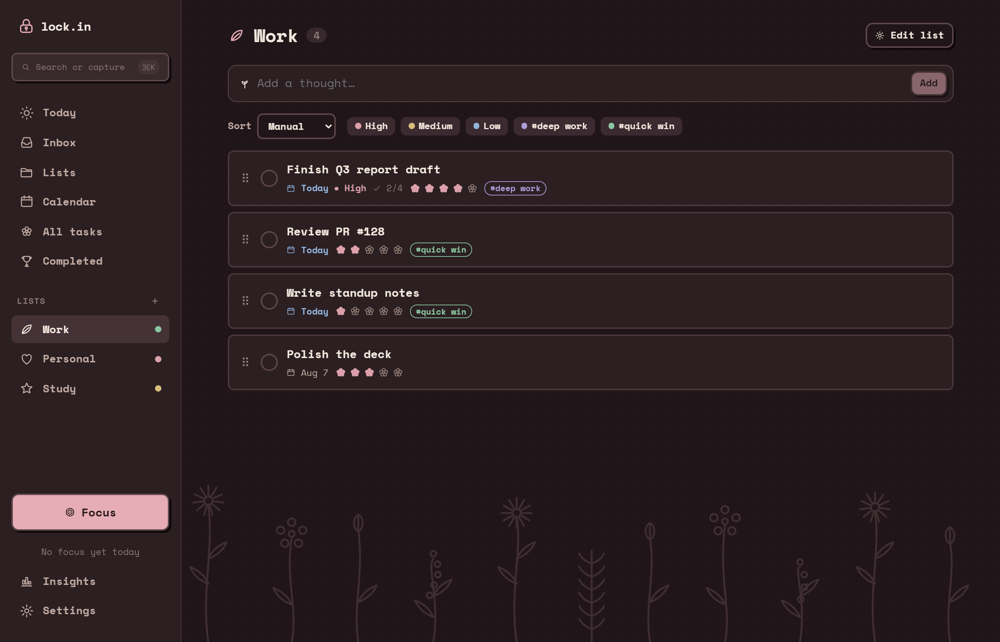
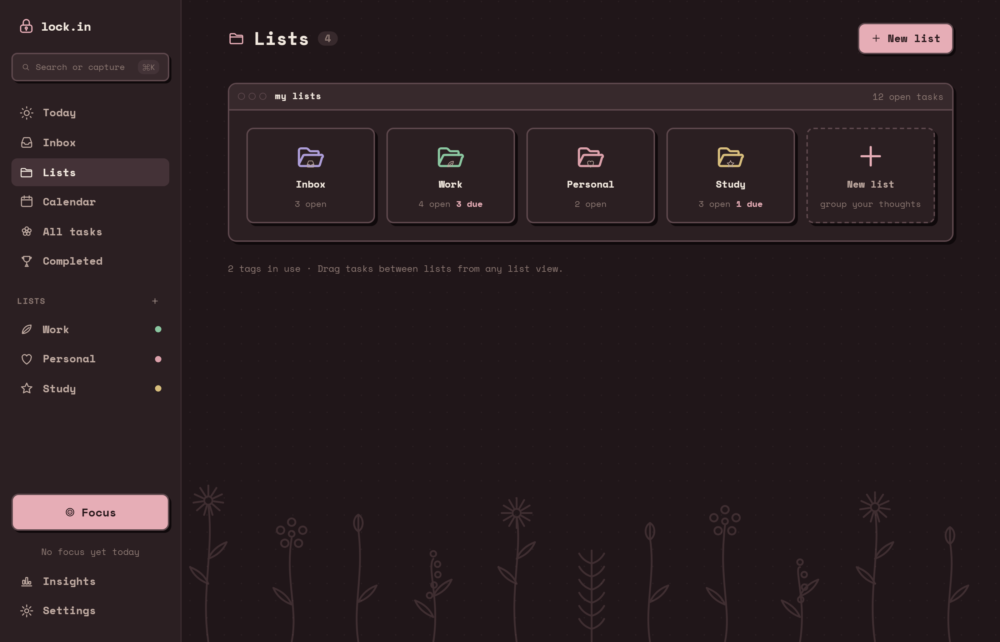
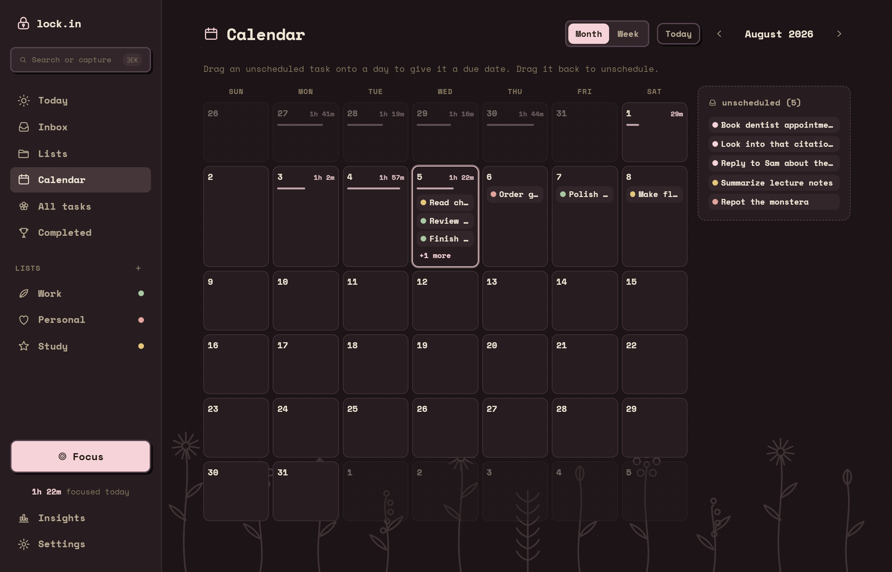
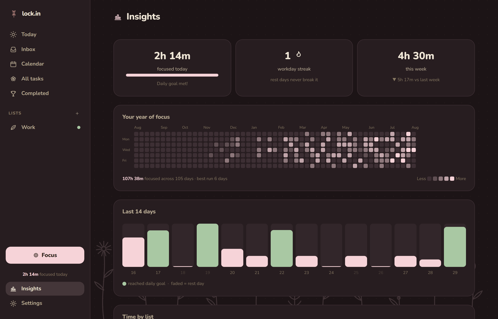
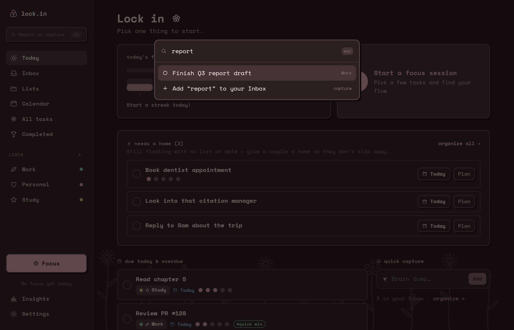
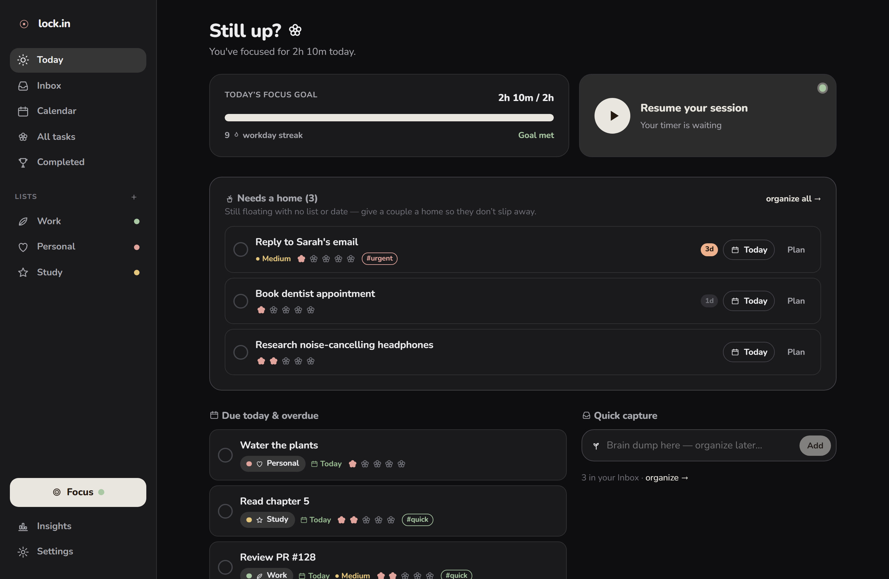
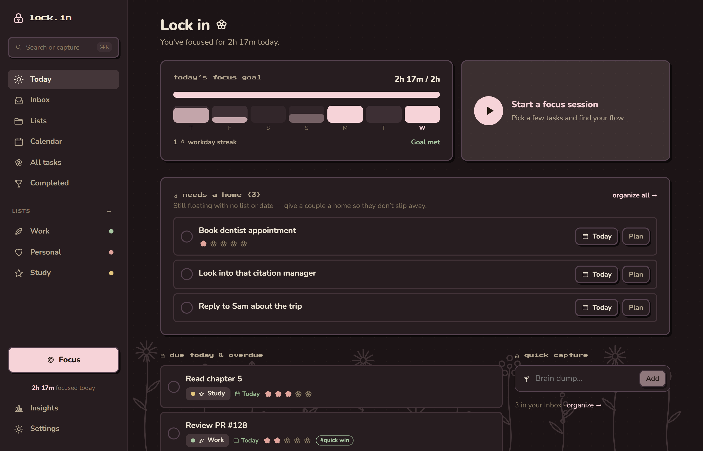
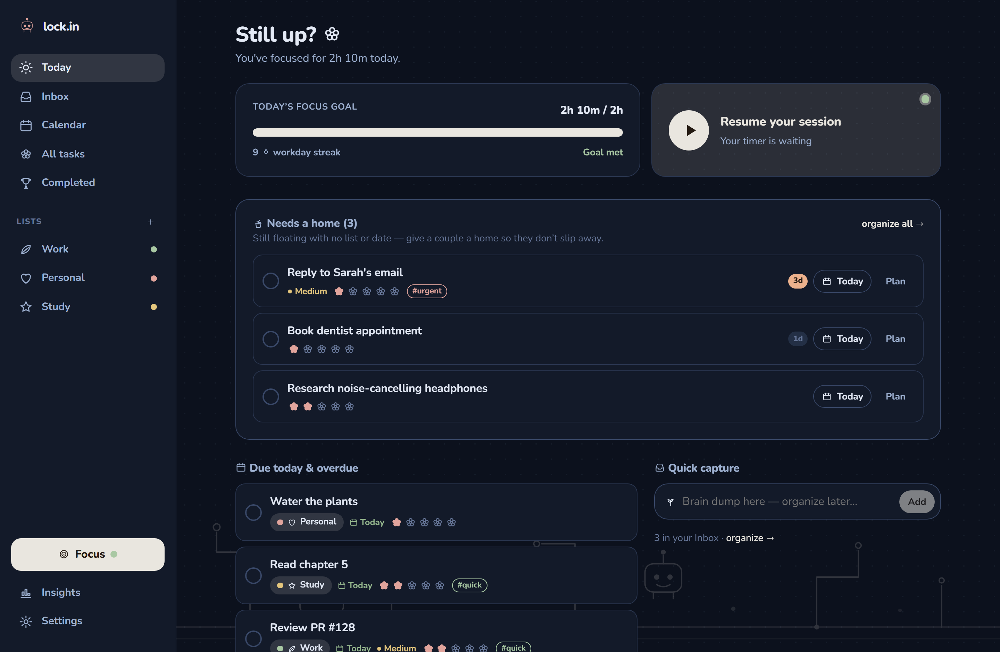

<div align="center">

# 🔒 lock.in

### a cozy, ADHD-friendly todo & focus app that helps you actually *lock in*

Capture the swirl of thoughts in your head, organize them when you're ready,
pick a few things to focus on, and lock in with a gentle timer that flexes to
your flow. Private, local-first, and yours.

**[▶ Open the live app](https://niceyraiyani.github.io/lock.in/)**  ·  **[⬇ Download desktop](https://github.com/niceyraiyani/lock.in/releases/latest)**



</div>

---

## 🌷 Why lock.in?

Most todo apps assume you already know what to do and just need a list. ADHD
brains work differently — thoughts arrive fast, dates are fuzzy, and a wall of
tasks is paralyzing. lock.in is built around how that actually feels:

- **Capture first, organize later.** Dump anything into your Inbox in one tap.
  No list, no date, no pressure. Sort it out when you have the bandwidth.
- **One clear thing at a time.** A focus session shows the single task you're on
  — not the whole overwhelming backlog.
- **A place for stray thoughts.** When your brain throws a random idea mid-focus,
  park it and keep going. It's saved, you can forget it.
- **Gentle, never punishing.** Timers flex, streaks respect your rest days, and
  when overdue tasks pile up you can sweep them all onto today in one click
  (undoable) instead of scrolling past a wall of red.

---

## ✨ Features

### 🎯 Focus sessions that flex to your flow
Build a little queue, work one task at a time, and lock in. Set a minimum
(default 30 min) — lock.in gives you a soft nudge when you reach it, then keeps
counting while you're in the zone. Pause, switch tasks, or check off subtasks as
you go. A **Parking Lot** catches distracting thoughts and drops them straight
into your Inbox.



### 📥 Capture & organize the way your brain works
Everything lands in the **Inbox**. Move things into lists when you're ready, add
tags, due dates, priority, notes, subtasks, and a 1–5 🌸 effort rating. Drag to
reorder, or sort and filter without losing your manual order. Undated tasks get
surfaced on Today ("Needs a home") so nothing quietly slips away.



### 🗂️ A desk of folders
**Lists** lays every folder out at a glance — open counts, what's due, and the
Inbox alongside them — so it's obvious where a thought belongs. Click a folder to
open it.



### 🗓️ A calendar you can drag onto
See your week or month at a glance. Got a task with no date? **Drag it onto a
day** to schedule it — drag it back off to unschedule.



### 📊 Insights that motivate, not shame
Focused hours today and this week, a workday streak that **never breaks on your
rest days**, a year-of-focus heatmap, a 14-day chart, time-by-list breakdown, and
your session history.



### 🔎 Find it — or dump it — in one keystroke
Hit <kbd>⌘K</kbd> / <kbd>Ctrl+K</kbd> (or just <kbd>/</kbd>) anywhere to search
every task by title, notes, or list. No match? Press Enter and whatever you typed
lands in your Inbox — so a thought that pops up mid-task never costs you your
place.



### 🚫 Site blocker (desktop app)
Name the sites that pull you away (YouTube, Reddit, socials…). In the desktop
app they're blocked **only while a focus session is running**, and work normally
the rest of the time — the same idea as
[SelfControl](https://github.com/SelfControlApp/selfcontrol), built right in.

### 🔔 One gentle reminder a day
The hardest part of a focus app is remembering it exists. Pick a time and lock.in
sends **one** notification — *"1 due today"* — and then leaves you alone. If
you've already started working, or already focused today, it stays quiet.

Reminders come through the service worker, so they land in your system tray and
survive closing the tab. Install lock.in (or use the desktop app) and they can
arrive with it fully closed.

### 🔁 Repeating tasks that give you a breather
Laundry every week, meds every day, weekly review every Monday. Tick one off and
it **disappears** — your list actually goes empty. It comes back on its next
date, not two seconds later wearing a new deadline.

Missed occurrences are **skipped, never stacked**: a weekly chore you ignored for
a month gives you one task, not four.

### 🧺 Chores aren't focus work
Some things need a 30-minute timer and your whole brain. Taking a tablet doesn't.
Mark a task **Routine** and it moves to a quiet "just do these" strip, stays out
of the focus-session picker, and stops asking you to rate its difficulty.

---

## 🎨 Make it yours

Pick a **vibe** that changes the whole feel — background, decorations, and the
little celebrations when you finish a task. Each is the same machine at a
different temperature: graphite, cocoa, or slate-teal. Then choose an accent
(Paper, Petal, Amber, Sage, Sky, or Lavender) and light/dark mode. Each vibe
automatically picks the accent that suits it best, and you can switch anytime.

**Retro chrome** (on by default) layers little window title bars, chunky
outlines, and flat drop shadows over whichever vibe you're in — old-desktop
nostalgia without touching the palette. Turn it off in Settings for a flatter,
quieter look. The whole app is set in a monospace face for that terminal feel,
with a true pixel font saved for the focus timer.

| 🌫️ Plain | 🌸 Flowers | 🤖 Robot |
|:---:|:---:|:---:|
| clean graphite | warm cocoa + wildflowers | cool slate-teal |
|  |  |  |

Everything's designed to be calm and low-stimulation: flat colors (no harsh
gradients or glow), soft rounded corners, gentle motion you can turn off, hand-
drawn line icons, and generous breathing room.

---

## 🔐 Private & local-first (with optional sync)

Your data lives **only in your browser on your device** by default — no account,
no server, no tracking. That means it's fast and completely private. It also means:

- Clearing your browser's site data will erase it, so **export a backup** now and
  then (Settings → Your data). You can re-import it anytime, on any device.
- The web app and the desktop app keep separate data — use Export/Import to move
  between them.

Want it on your laptop *and* your desktop? Turn on **cloud sync**: sign in with
Google or an email & password, and lock.in keeps your tasks in step across
devices. Signing in is all it takes — there's nothing to configure. It's opt-in,
free, and row-level security means **only you** can read your own tasks. Running
your own copy of lock.in? See **[docs/CLOUD_SYNC.md](docs/CLOUD_SYNC.md)** for the
5-minute Supabase setup. Not signed in? Nothing ever leaves your browser.

lock.in is an installable **PWA**: open it in your browser and it works offline;
click *Install* to run it in its own window like a native app.

---

## ⬇ Get lock.in

### Use it in your browser (nothing to install)
Just open **<https://niceyraiyani.github.io/lock.in/>**. To keep it handy,
click the install icon in your address bar to pin it as an app.

### Download the desktop app (adds real site blocking)
Grab the latest installer from the
**[Releases page](https://github.com/niceyraiyani/lock.in/releases/latest)**:

- **macOS** — the universal `.dmg`
- **Windows** — the `.exe` (or `.msi`) installer

> **Heads up:** the app isn't code-signed (no paid certificate), so your OS may
> warn about an "unidentified developer." On macOS, right-click the app → **Open**
> once; on Windows, click **More info → Run anyway**.
>
> Site blocking edits your system `hosts` file, which needs elevated rights
> (macOS: run with `sudo`; Windows: **Run as administrator**). Without it, the
> app still works — it just skips blocking with a friendly message.

---

## 🛠️ Tech

React 19 · TypeScript · Vite · Dexie (IndexedDB) · dnd-kit · Vitest, with an
optional **Tauri** (Rust) desktop shell for the hosts-file site blocker. It's
structured behind a clean storage boundary with stable IDs and timestamps, so
cloud sync could be added later without rewriting the UI.

### Run it locally

```bash
npm install --legacy-peer-deps
npm run dev        # local dev server with hot reload
npm test           # run the test suite
npm run build      # type-check + production build
npm run lint       # oxlint
```

### Build the desktop app

Needs [Rust](https://rustup.rs) plus your platform's Tauri prerequisites
(macOS: Xcode command-line tools; Windows: VS Build Tools + WebView2).

```bash
npm run desktop:dev      # run the desktop app with hot reload
npm run desktop:build    # produce a distributable installer
```

Pushing a `v*` tag builds and publishes installers for macOS & Windows via
GitHub Actions.

---

<div align="center">

Made with care for calmer, kinder productivity. 🤍

</div>
